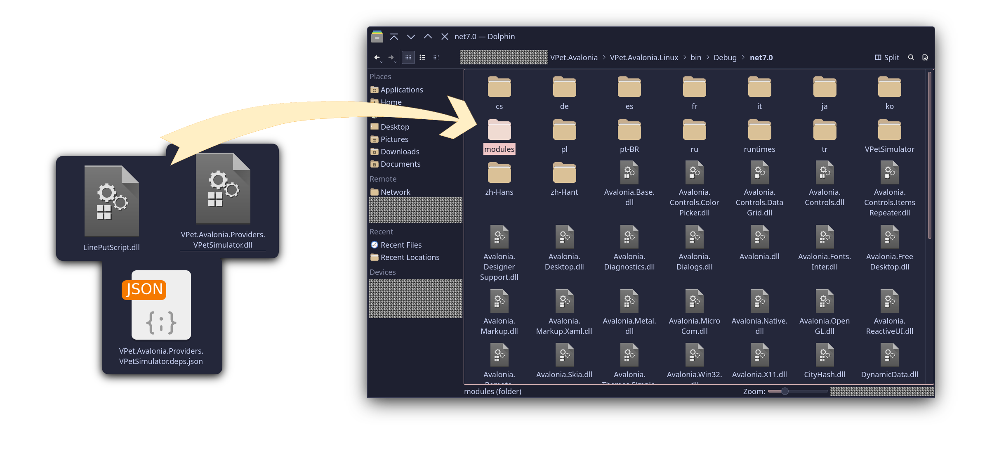

# VPet.Avalonia
A cross-platform virtual desktop pet application. Powered by avaloniaUI. Inspired by LorisYounger's VPet-Simulator.

This application is flexible to able to add more way to implement customise your virtual "desktop" pet, 
and its complete refactored, created based on principle working procedure of VPetSimulator (uses SpriteSheet as visual part)

> If you want to use LorisYounger VPet-Simulator assets to this application, you can follow the instruction in the below.

# TODO:
- more refactoring (the framework, external library API layer) 
- game logics implementation
- other way to render (2D mesh and 3D mesh if possible)
- more flexible mod API (creating more ways to implement logics and features)
- a documentation (how to use, API documentations)
- and less spaghetti (easy to maintenance)

# Supported platforms:
- Linux (tested on Ubuntu with KDE desktop environment 5.27, X11)
- Windows (not implemented and tested yet, the implementation will appear later).
- macOS (not implemented and tested yet, Ill do it if I have a macbook or a mac mini at least).

# Available modules:
- VPetSimulator module (available as a additional module due to the whole spaghetti).
- to be added later :P

# How to setup VPet.Avalonia.Providers.VPetSimulator?
- Get a compiled assembly from Releases or compile it by yourself. The source code can be obtained from [Folder VPet.Avalonia.Providers.VPetSimulator](./VPet.Avalonia.Providers.VPetSimulator).
- Move or copy `LinePutScript.dll`, `VPet.Avalonia.Providers.VPetSimulator.deps.json` and `VPet.Avalonia.Providers.VPetSimulator.dll`
to `<game-root-folder>/modules`. If you have any requirements to debugging the modules, it is recommended to put `*.pdb` files to the same
directory, too.

- Download the game from [VPetSimulator Steam page](https://store.steampowered.com/app/1920960/VPetSimulator/) or
[VPetSimulator github repository (extract the folder VPet-Simulator.Windows from source archive)](https://github.com/LorisYounger/VPet). It requires approx. 700 MiB (or might even more).
- Copy the `mod` folder from the game to the folder `<game-root-folder>/VPetSimulator`

<!--
# FAQ (frequently asked questions)
> TODO
-->